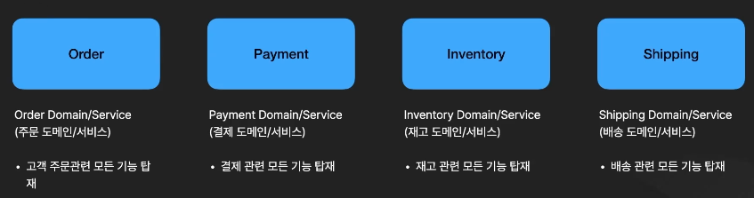

# 도메인이란?

## Microservice를 어떻게 나누어야 하는가?

- Microservice의 목적은 서비스 간의 의존성을 줄이고 효율적으로 독립적 개발을 진행하기 위함 => 가장 작은 논리적 단위로 서비스를 분해할 수 있으면 가장 효율적인 MSA를 운영할 수 있음.
- 가장 작은 논리적 단위 = "도메인" = 비즈니스의 중심 기능이 되는 비즈니스 로직

## 온라인 쇼핑몰 예제

- 각 도메인은 코어 비즈니스 기능을 담당
- 개발자가 아닌 일반 사람이 한 도메인의 명칭을 봤을 때, 무슨 역할을 하는지 알 수 있게 분리해야 한다. (Domain Expert)
- 처음부터 완벽히 도메인을 나눌 필요가 없다. 개발해가면서 독립 가능하다고 생각하는 부분들을 분리하면 된다. (Shipping domain에 일반 택배, 항공 택배를 같이 구현하다가 서로 관련성이 멀어지고 너무 커지면 나중에 나눠도 된다.)
- 도메인을 다룰 때, 그 도메인 하나의 관점에서 작업을 한다.
  - Order에서 Customer(고객)가 존재하고, Payment에도 Payer(고객)이 존재할 수 있다. 둘은 같은 사용자를 지칭하지만 서로 다른 도메인이므로 이는 중복이 아님
