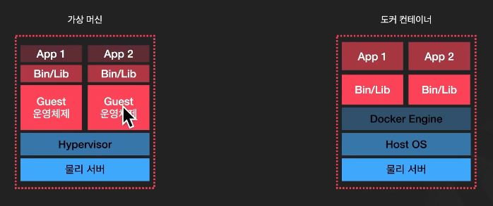

# Docker

## Docker란?

애플리케이션을 컨테이너로 개발, 배포, 실행할 수 있게 해주는 플랫폼.  
컨테이너는 개발자가 애플리케이션과 모든 의존성을 함께 패키징할 수 있게 해주어, 다양한 환경에서 일관성을 유지할 수 있다.

도커는 하나의 시스템 전체를 패키징할 수 있도록 도와준다. 마치 가상 머신에 스크립트를 실행시키는 것과 비슷한 느낌이 있지만 많은 차이점이 존재하다

## 컨테이너 vs 가상머신



- 가상머신: 운영체제 전체를 포함하고 있어서 리소스를 많이 차지
- 컨테이너: 호스트 OS 커널을 공유하면서 애플리케이션을 독립된 환경에서 실행. 컨테이너는 훨씬 가벼움

### 이미지와 컨테이너


OOP로 비유하면 쉽게 이해 가능. 이미지는 Class, 컨테이너는 Class로 생성된 인스턴스

- 미리 정의된 이미지를 다운받을 수 있다.
- 이미지를 실행하면 컨테이너라고 부른다.
- 클래스로 여러 개의 인스턴스를 만들 수 잇는 것처럼, 이미지 하나로 여러 개의 컨테이너를 실행할 수 있다.

#### 이미지 다운로드

Nginx가 정의되어 있는 이미지를 다운받을 수 있다.

```
docker pull nginx
```

#### 이미지 실행

Nginx를 다운받지 않더라도 Nginx를 원하는 갯수만큼 컨테이너로 실행할 수 있다.

```
docker run -d -p 80:80 --name my-nginx nginx
```

한번 실행하고 삭제하는데 매우 오래 걸리는 가상머신과 달리 도커 컨테이너는 매우 빠르고 편리하게 컨테이너를 실행하고 삭제할 수 있으며, 월등히 적은 리소스를 필요로 한다.

## 기본 Docker 명령어

1. 이미지 다운로드

```
docker pull nginx
```

2. 컨테이너 실행

```
docker run -d -p 80:80 --name my-nginx nginx
```

- 결과: 컨테이너 ID 출력

3. 실행중인 컨테이너 조회

```
docker ps
```

4. 컨테이너 중지 및 삭제

```
docker stop my-nginx
docker rm my-nginx
```

5. 이미지 리스트 출력

```
docker images
```

6. 이미지 삭제

```
docker rmi nginx
```

7. docker hub로 push

```
docker push your-dockerhub-username/your-image
```

8. Docker file 기반 이미지 빌드

```
docker build -t my-node-app .
```

## Dockerfile

Dockerfile은 도커 이미지를 만들기 위한 설정 파일

프로그램을 실행하기 위한 환경을 정의하고, 그 소프트웨어를 컨테이너로 패키징할 때 필요한 명령어들이 정의되어 있음

일반적으로 Dockerfile 내에 포함되는 것

- 베이스 이미지
- 파일 복사
- 필요한 패키지 설치
- 포트 설정
- 명령어 실행

도커는 이 Dockerfile을 바탕으로 이미지를 빌드하고, 이미지를 이용한 동일한 환경을 구축할 수 있게 해준다.

#### 고려사항

- Alpine 처럼 가벼운 이미지를 사용하는 것이 유리하다.
- 루트 사용자가 아닌 다른 사용자로 실행하는게 좋다.
- Dockerfile은 명령어 단위로 레이어 캐싱을 한다. 명령어 순서를 신중히 배치하면 빌드 속도가 빨라진다.

## Docker Compose

- Compose는 여러 개의 컨테이너로 이뤄진 애플리케이션을 하나의 docker-compose.yml 파일로 정의하고 관리할 수 있다. 여러 컨테이너를 하나하나 실행하고 관리하면 너무 복잡하니 하나의 커맨드로 통일해서 관리할 수 있게 하기 위해 발명되었다. 프로덕션 환경에서는 잘 사용하지 않고 개발 환경에서 많이 사용된다.

#### docker-compose.yml

Dokcer Compose 파일은 여러 컨테이너로 구성된 애플리케이션을 정의하고 동시에 실행할 수 있게 해주는 YAML 형식의 설정 파일이다.
이 파일에 여러 개의 Docker Container를 어떤 방식으로 실행할지 정의할 수 있다.

## Docker Compose 명령어

1. 모든 컨테이너 실행

```
docker-compose up
```

2. 모든 컨테이너 빌드 후 실행

```
docker-compose up --build
```

3. 모든 컨테이너 종료

```
docker-compose down
```
