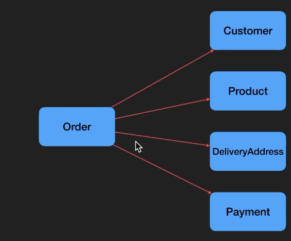

# Entity 구성하기

- Order: 주문 정보 통합 저장
- Customer: 주문한 사람
- DeliveryAddress: 주문 배송 주소
- Payment: 주문 결제 방법
- Product: 주문 상품

### 관계

- Customer = 주문을 한 사람
  - 모놀리틱에서는 유저가 어울릴 수 있으나, 주문 도메인에서는 고객이 더 잘 어울린다.
  - 결제 도메인에서는 결제자(Payer)가 더 잘 어울릴 수 있다.
- Product = 어떤 상품을 주문했는지
- DeliveryAddress = 어디로 배송해야 하는지
- Payment = 어떤 결제 방법으로 결제했는지

# SQL vs NoSQL

NoSQL의 장점은 구조화되지 않은 데이터를 하나의 Document로 한번에 저장할 수 있다는 것이다.  
populate를 통한 join 기능이 가능하긴 하지만 보통 하나의 Document가 통째로 유의미한 데이터를 보여주게 된다.

SQL은 관계형 데이터베이스로 다양한 join 기능과 함께 "현재 상태"를 정확히 보여줄 수 있다.
그렇다면 Order 데이터를 최신 현재 상태를 반영해야 하는 데이터일까? (Order 객체의 Customer, DeliveryAddress, Product, Payment는 매번 최신 데이터가 반영되어야 하는가?)

-> 최신 데이터를 반영하지 않아야 한다.  
내가 사과를 주문한 시점에서 1000원에 구입했는데, 1500원으로 올라버린 경우에 내 주문 데이터는 1000원으로 유지되어야 한다. (주문한 시점의 데이터의 스냅샷 상태로 보관해야 한다.)

