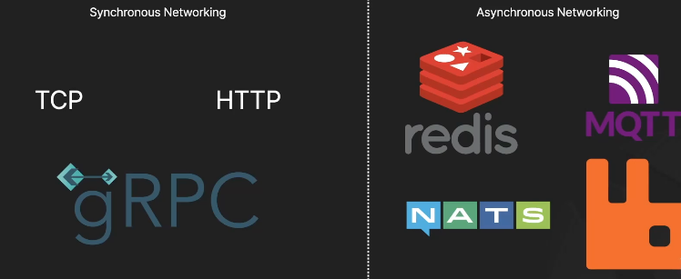
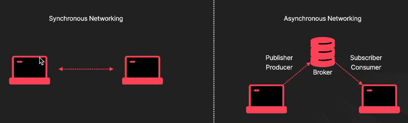
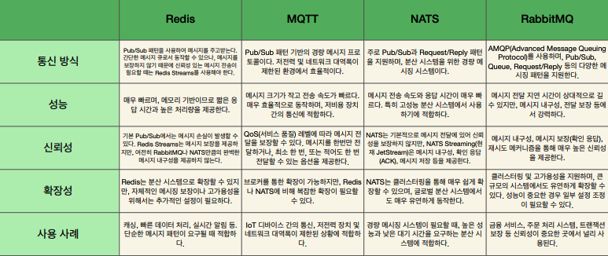
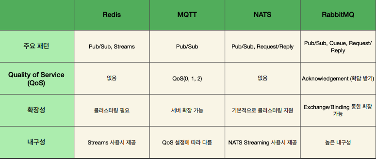

# Message / Event Brokers (Transporter)

### MSA 간의 통신에는 TCP말고 다른 옵션도 존재한다.

TCP, HTTP는 요청을 보낸 것에 응답을 받을 수 있다는 특징이 있다.
gRPC는 동기 네트워킹 방식에서 많이 사용되는 방식

비동기 통신 방식의 특징은 기술들이 중간 브로커 역할을 한다.

### Synchronous Networking vs Asynchronous Networking

Broker란 메시지 또는 이벤트를 중개하는 소프트웨어를 말한다.

#### Synchronous Networking

- 요청을 보낸 후 응답이 돌아올 때까지 기다리는 방식
- 요청 응답이 끝난 다음, 작업을 진행한다.
- 응답 시간이 긴 요청이 있는 경우 시스템 전체의 성능이 저하될 수 있다.
- 통신하는 마이크로서비스끼리 Tight Coupling이 된다.
- 전화 통화를 상상하면 된다. (전화를 걸면 상대방이 전화를 받아야 하고, 통화가 끝날 때까지 기다려야 한다)

#### Asynchronous Networking

- 요청을 보낸 후 응답이 올때까지 기다리지 않고 다른 작업을 처리할 수 있는 방식이다.
- 응답 대기 시간 동안 다른 작업을 처리할 수 있기 때문에 자원을 효율적으로 사용할 수 있다. (대규모 트래픽에 적합)
- 코드가 복잡해질 수 있고, 관리가 어려워질 수 있다.
- 메시지/이벤트가 한 번 이상 전달되는 상황을 고려해야한다.
- 이메일을 생각하면 된다. (이메일을 보내두면 언젠가 상대방이 이메일을 읽을 것을 생각하고 다른 작업을 하고 있을 수 있다.)

### Broker란?

#### Broker 종류 비교

