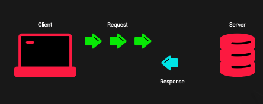

# gRPC란

- gRPC는 Google Protocol Buffer를 사용하는 Microservice에서 사용하기 적합한 높은 퍼포먼스를 보여주는 통신 프로토콜

RPC는 Remote Procedure Call의 약자로 내부 함수를 실행하는 것처럼 다른 서버의 함수를 실행할 수 있다. 실제 요청은 네트워크 통신으로 전달되지만 실행하는 방식은 내부 함수처럼 실행할 수 있다.

gRPC를 사용하면 language agnostic(언어와 관계없이) 일관된 언어로 통신 규칙을 규정할 수 있다.

gRPC 주요 포인트

- HTTP/2를 사용
- HTTP/2는 메시지를 바이너리로 인코딩하므로 JSON 보다 빠르게 전송될 수 있다.
- Unary, Server Streaming, Client Streaming, Bi-Directional Streaming이 가능하다.

### Unary


### Server Streaming


### Client Streaming



### Bi-Directional Streaming


### Protobuf 문법

```grpc
syntax = 'proto3';

package codefactory;

service UserService {
  rpc Unary(UserRequest) returns (UserResponse)

  rpc ClientSideStreaming(stream UserRequest) returns (UserResponse)

  rpc ServerSideStreaming(UserRequest) returns (stream UserResponse)

  rpc BiDirectionalStreaming(stream UserRequest) returns (stream UserResponse)
}

message UserRequest {
  string name = 1;
}

message UserResponse {
  string result = 1;
}

```

- Service는 컨트롤러와 유사한 개념
- message는 요청과 응답에 대한 타입
  - message 끼리 nest할 수 있다.

### Scalar Type 종류

#### Basic Type

- bool -> 불리언 타입
- string -> 스트링 타입
- bytes -> 바이트 타입 (raw data, binary data)
- enum -> enum 타입

#### Modifier

- repeated -> Array 타입

#### Integer Type

- int32, int64 -> 32, 64 비트 정수 타입
- uint32, uint64 -> 32, 64 비트 양의 정수 타입
- sint32, sint64 -> 32, 64 비트 음의 정수 타입

#### Floating Point Type

- float -> 32비트 소수 타입
- double -> 64비트 소수 타입

### gRPC to TS


