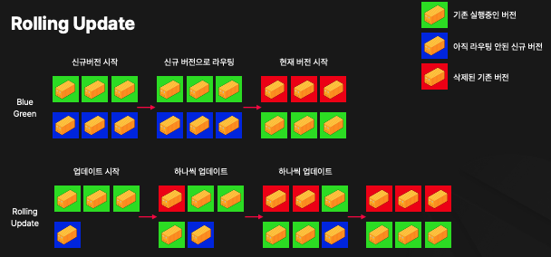
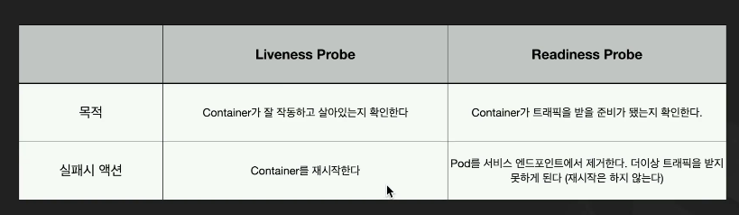
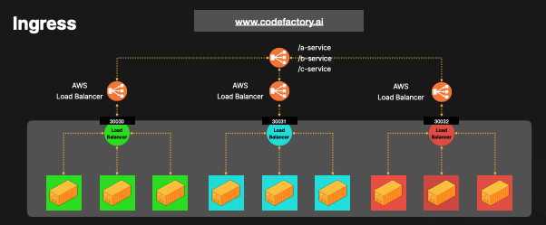
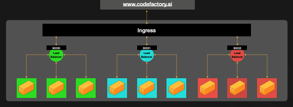
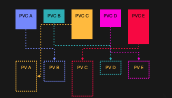

# Kubernetes

K8s는 구글에서 만든 컨테이너 오케스트레이션 시스템이다.

- 자동 배포 및 스케일링: 트래픽에 따라 컨테이너들을 자동으로 업스케일링 또는 다운스케일링할 수 있다.
- 자가치유: 컨테이너가 반응이 없어지면 자동으로 새로운 컨테이너로 교체한다.
- 로드밸런싱: 여러 컨테이너에 트래픽을 자동으로 분산시킨다.
- Service Discovery: 복잡한 절차없이 자동으로 컨테이너간 통신을 제공한다.
- Resource Management: CPU와 메모리를 효율적으로 배분하여 하드웨어 사용을 최적화한다.
- Rolling Update / Rollback: 다운타임 없이 롤링 업데이트를 진행하고 손쉽게 롤백을 할 수 있다.

### K8s Node

K8s가 사용할 수 있는 물리적인 컴퓨터 자원을 Node라고 명칭한다.

#### Node의 종류

- Master Node(Control Plane Node): API Server, Scheduler, Controller, Manager 등이 실행되고 있고 쿠버네티스 클러스터 전체를 통제한다. Master Node에는 Pod을 실행하지 않는다.
- Workder Node: 사용자가 정의한 애플리케이션 컨테이너들이 실행되는 Node

#### Worker Node의 구성

- Kubelet: Master Node와 통신하는 역할.
- Container Runtime: docker, containerD같은 컨테이너를 실행하고 관리하는 런타임
- Kube Proxy: 각 노드의 네트워크 룰을 정의
- Pod: 쿠버네티스에서 사용하는 용어 중 가장 작은 단위. 보통 하나의 Pod에 하나의 컨테이너를 실행하게 된다.

#### Kubernetes Pod

- k8s node에는 Pod를 실행할 수 있다.
- Pod는 k8s에서 사용하는 가장 작은 애플리케이션 단위이다.

#### Multiple K8s Pod

- 리소스만 허락한다면 여러개의 Pod를 Node에서 실행할 수 있다.
- 여러 개의 Node에 균등하게 또는 설정을 통해 특정 Node에만 Pod가 실행되도록 할 수 있다.

#### Multiple Containers in Pod

- Pod 하나에는 하나의 컨테이너를 실행하는 것이 일반적
- 하지만 컨테이너와 밀접한 통신을 요구하는 경우 Pod에 여러개의 컨테이너를 실행할 수도 있다.
  - A Pod의 보조 역할을 하는 B Pod가 존재한다고 가정하면 A Pod가 생성될 때마다 B Pod를 항상 함께 생성해야 한다는 단점이 있다.
  - 매번 2 개의 Pod를 실행하고 삭제하려면 매우 번거롭고 Pod 간의 통신도 설정해줘야 한다.
  - 그래서 밀접한 관계가 있는 경우, 하나의 Pod에 여러 개의 컨테이너를 실행한다.

### ReplicaSet

ReplicaSet은 K8s 스케일링 기능의 핵심으로 명시된 Pod 갯수가 항상 실행되고 있을 수 있도록 보장해주는 역할을 한다.

#### 특징

- 고가용성: 똑같은 Pod를 여러개 복제해서 한 Pod가 문제가 생기더라도 다른 Pod가 역할을 대체할 수 있도록 설계하는 것
- 로드밸런싱: 여러 개의 Pod를 실행하면 같은 역할을 하고 있는 Pod 간 트래픽을 분산해줄 수 있는 시스템이 필요하다.
- 스케일링: 설정한 Pod의 갯수만큼 자동으로 Pod 갯수가 늘어나고 줄어들도록 해준다. ReplicaSet은 하나의 Node에 귀속되지 않고 여러 Node에 걸쳐 설정될 수 있다.
- 레이블 셀렉터: 레이블 정의에 따라 ReplicaSet 정의에 입력해두지 않은 Pod들도 ReplicaSet에 의해 관리되도록 할 수 있다.

#### Deployment

- Deployment를 생성하면 자동으로 ReplicaSet을 생성한다.
- Deployment는 ReplicaSet에 Rolling Update와 Rollback 기능이 추가되어 있다.

#### Rolling Update

- Blue Green 업데이트 할때 리소스가 두배로 필요
- Rolling Update를 하면 최소한의 추가 리소스로 전체 업데이트를 진행할 수 있다.
- Blue Green Update는 네트워크 설정이 조금 엇나가면 서비스에 다운타임이 생길 수 있다.
- Rolling Update는 서서히 업데이트를 진행하기 때문에 다운타임이 생기지 않는다.

확인해볼 것:

- https://onlywis.tistory.com/10
- https://www.slideshare.net/slideshow/ci-cd-pipleine-on-aws/110068100

### NameSpaces

- Namespace는 Kubernetes 클러스터에서 환경을 분리하는데 사용된다.
- Namespace가 다른 Pod끼리 통신은 가능하지만 kubectl CLI를 사용할 때 현재 지정되어 있는 namepsace를 기준으로 실행된다.

### ConfigMaps/Secrets

- ConfigMap과 Secret은 K8s에서 애플리케이션 설정은 관리하는 리소스다.
- Pod에 ConfigMap, Secret에 설정된 값들을 환경변수로 주입해줄 수 있다.
- ConfigMap은 Plain Text로 민감하지 않은 데이터를 저장할 때 사용
  - ex) URL, 포트정보
- Secret은 암호화가 필요한 값들을 저장할 때 사용된다.
  - ex) 비밀번호, API 키, 인증서

### Readiness Probe / Liveness Probe

- 둘 다 모두 Container의 상태를 모니터링하는데 사용된다.
  

### k8s Service

- K8s Service는 Pod들을 네트워크로 연결할 때 사용한다.
- K8s Service는 대표적으로 NodePort, ClusterIP가 존재한다.

#### NodePort

- NodePort는 말그대로 외부에서 Node에 접속할 수 있게 해주는 포트를 의미한다.
- 30000번 포트부터 32767번 포트까지 사용 가능하다.
- 여러 개의 Pod를 Load Balancing할 수 있고, 여러 개의 Node를 포괄할 수도 있다.

#### ClusterIP

- ClusterIP는 K8s의 Pod끼리 통신할 수 있도록 해주는 서비스
- k8s에서는 자연스럽게 같은 Pod를 여러 개 실행해서 Horizontal Scaling을 하고 언제나 Pod가 사라지고 새로 생겨서 IP가 변동적이니 같은 Pod들을 묶어주는 역할이 필요하다. ClusterIP가 이 역할을 해준다.

### Ingress

- NodePort 대신 LoadBalancer를 사용하면 클라우드 LoadBalancer를 프로비져닝하도록 할 수 있다.
- 문제는 서비스가 많아질 수록 LoadBalancer가 너무 많아지고, LoadBalancer 별로 세팅을 따로 해줘야 한다는 점이다.

- Ingress는 복잡한 Kubernetes와 외부 트래픽을 한번에 연동 해줄 수 있도록 도와준다.

### Persistent Volume & Claim

- Persistent Volume은 특정 Pod와 관계 없이 저장 리소스를 배정할때 사용된다. 원하는 크기로 PV를 배정해두면 Pod에서 PV가 필
  요할때 PVC를 통해 적절한 PV를 할당받게 된다.
- PVC는 PV를 점유할때 사용된다. Pod에서 필요한 스펙의 저장 공간을 PVC로 정의하면 Kubernetes에서 자동으로 현재 사용 할 수
  있는 PV 중에 적합한 저장소를 배정해준다.
