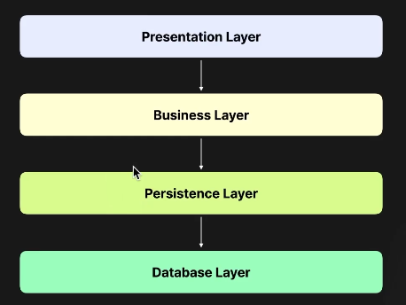

# Layered Architecutre

### Layered Architectur 소개

- 소프웨어를 여러 개의 레이어로 나누는 설계
- 각 레이어 별로 특화된 영역을 담당한다.
- 모든 레이어는 바로 아래의 레이어에만 의존한다.
- 레이어를 어떻게, 몇 개로 나눌지에 대한 정답은 존재하지 않는다.

### 파트별 소개

- Presentation Layer: UI를 의미하며, Nestjs 문맥에서는 Controller가 된다.
- Business Layer는 실제 비즈니스 로직을 담당하는 영역. NestJS에서는 Service가 해당된다.
- Persistence Layer는 영속성 레이어이며, "영속성"이므로 데이터베이스를 의미하는 것으로 생각할 수 있지만 이 상황에서는 데이터베이스와 연동하는 레이어이다.
- Database Layer는 데이터베이스의 영역이다.

### Layered Architecture의 문제
- 모든 아키텍처의 공통 관심사는 "의존성"이다. 어떤 방향으로 의존성이 전파되고 있는지가 매우 중요하다.
- Layered Architecture는 위에서 아래로 의존하는 구조이다.
  - Top Down 방식이 사람에게 가장 자연스러운 구현이기 때문에, 현대 소프트웨어에서 Layered Architecture를 자연스럽게 많이 사용하게 된다.
- Layered Architecture는 결국 모든 레이어가 가장 아래에 의존하기 때문에, 소프트웨어 설계를 할 때 자연스럽게 데이터베이스 설계부터 생각하게 된다.
  - 우리가 일반적으로 SW를 만들 때, 테이블 어떻게 만들지부터 생각한다.
- 소프트웨어가 풀어내려는 가장 중요한 문제는 비즈니스 로직인데, 이부분이 외부적인 요인에 영향을 받게 되는 것이 맞는것인가?이다
- 이것이 잘못되었다고 생각한 사람이 만들어낸 아키텍처가 Clean Architecture와 Hexagonal Architecture다.