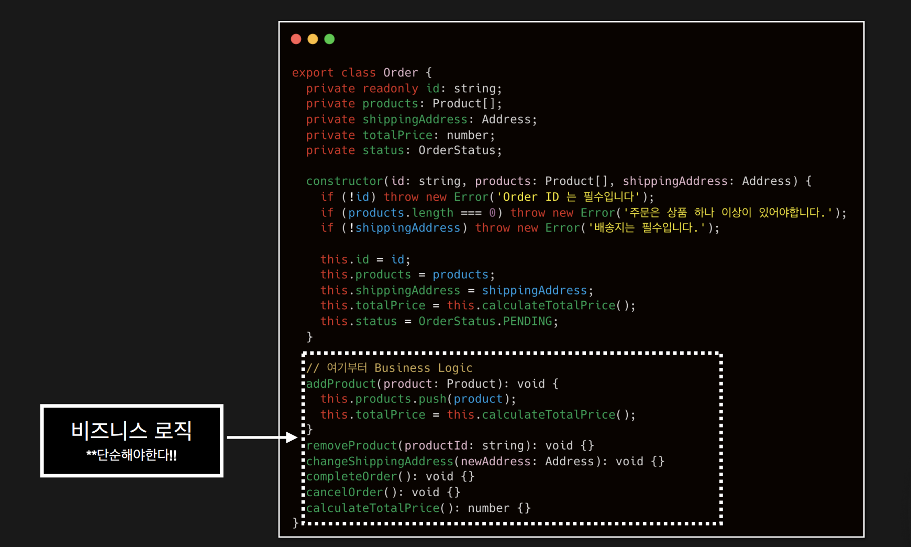
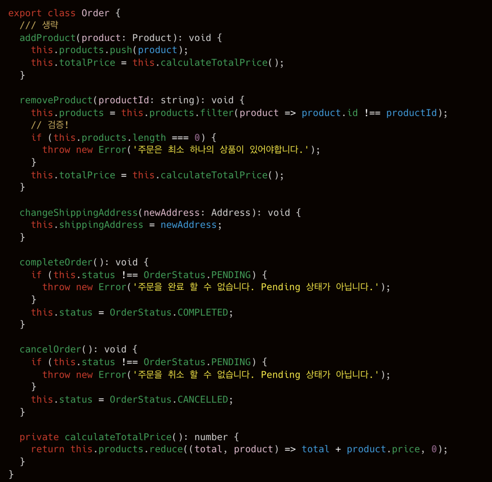
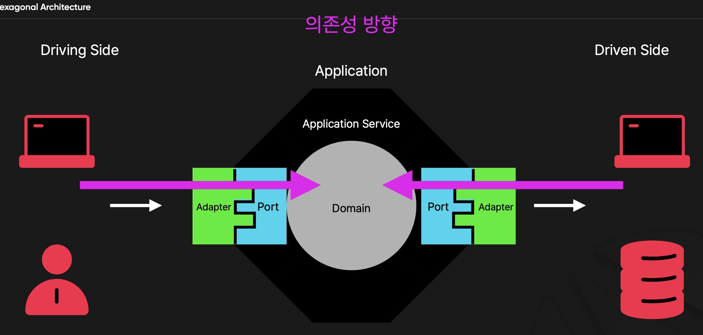
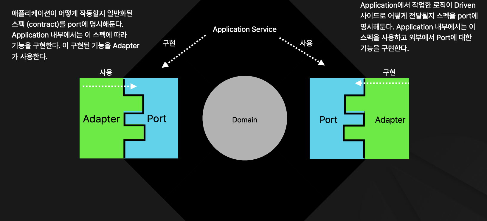
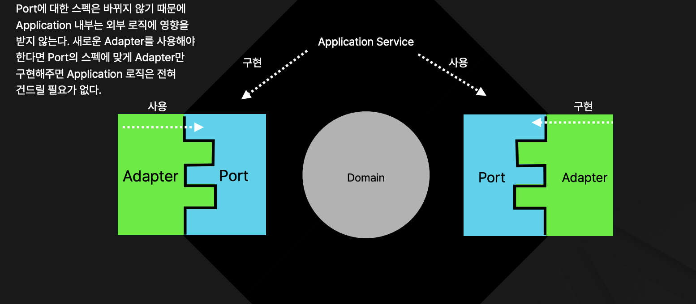

# Hexagoanal Architecture

### Hexagoanl Architecture 아키텍처란?

- Hexagonal Architecture는 Domain을 중앙에 감싸는 아키텍처중 가장 먼저 고안된 아키텍처 중 하나이다.
- Port and Adapter 패턴으로도 불리며 개인적으론 이 명칭이 조금 더 아키텍처의 특성을 잘 표현한다고 생각한다.
- 더이상 Layered Architecture 처럼 Top Down 형태가 아니다.
- 도메인을 중심으로 설계되고 외부 의존성들을 Domain의 설계에 맞춰서 프로그래밍 하게 된다.
- 도메인이 중심에 있고 바깥이 내부로 의존하는 구조를 갖게 된다. 가장 중심에는 도메인이 있기 때문에 도메인은 그 무엇에도 의존하지 않는 독립적인 존재가 된다. 즉, 중심 비즈니스 로직은 외부에 영향을 받지 않게 된다

### 도메인이란

- Domain이란 소프트웨어에서 해결하고자하는 특정 비즈니스 영역을 얘기한다.
- Domain은 실제 비즈니스나 시스템의 문제, 프로세스, 규칙 등을 포함하며 이를 소프트웨어에 반영한다.
- 소프트웨어에서 해결해야하는 “핵심 관심사”다. “핵심 관심사”이기 때문에 큰 틀에서 자주 바뀌지 않는다.
- 전자 상거래 시스템에는 주문, 결제, 재고관리, 고객이 도메인이 될 수 있다. (마치 우리가 생성한 마이크로서비스처럼)
- 의료 시스템에는 환자 기록, 예약, 치료 과정 등이 도메인이 될 수 있다.
- 도메인은 “실제” 비즈니스에서 해결해야하는 관심사이기 때문에 개발자가 아닌 사람들과 용어 소통이 용이하다.
  - 일반 사람들도 이해 할 수 있는 용어인 “주문”, “결제”, “재고”등이 용어가 되기 때문에 비개발자도 이해하기 쉽다.
  - 이걸 Ubiquitous Language (공통 언어)라고 부른다.

### 도메인 객체란?

- Domain 객체는 Domain을 추상적으로 표현한 클래스다.
- 우리가 지금까지 제작해온 Entity들이 Domain 객체와 매우 “비슷”하다.
- Domain 객체는 프로젝트에서 가장 중심되는 코드이다.
  - 예를 들어서 쇼핑몰 시스템의 결제 PG사가 A사에서 B로 변경된다고 하더라도 도메인 객체에 “결제”라는 개념이 존재해야한다는 건 변하지 않는다.
- 도메인은 비즈니스 로직의 중요한 부분을 담당하지만 외부 의존성 없이 가장 필요한 부분만 단순하게 구현한다.
  - 네이티브 언어로 구현 가능한 로직과 검증을 주로 구현한다.

#### 도메인 객체 예시

#### Domain Business Logic

- 도메인의 가장 중요한 논리들을 담고있는다.
- 가장 중요하지만 단순한 로직으로 행사한다.
- 외부 의존성이 없어야한다. 외부에 의존하게 되면 외부 의존성이 변경됐을때 도메인이 함께 변경돼야 한다. 도메인은 절대로 외부에 의해 변경 되면 안된다.
- 비즈니스 로직의 큰 변경사항이 있다면 이 변경사항은 도메인으로부터 파생돼야한다. 다른 외부 요소가 도메인을 변경시키면 안된다.

#### 의존성

Application: 프로그램
Driving Side: 클라이언트(다른 MSA, UI, 실제 사용자) / 요청을 하는 쪽
Driven Side: 애플리케이션에 의해 실행되는 부분

Port는 Adapter가 연동할 수 있는 스펙의 명시이므로 항상 interface 형태로 구현한다. (OOP의 Interface를 꼭 써야한다는 이야기는 아님)

- Port에 맞춰 Adapter를 구현한다.
  

### Dependency Inversion

- 어떻게하면 도메인을 그 무엇에도 의존하지 않도록 만들 수 있을까?
- 단순한 질문이지만 처음 “아키텍처”의 개념을 접한다면 어려울 수 있다.
- Layered Architecture는 Top Down 방식이기 때문에 인프라가 변동되면 어쩔 수 없이 비즈니스 로직이 변경된다. 우리가 제작한 프로그램에서 ORM을 TypeORM에서 Mongoose로 변경한다고 생각해보자. 모든 Service 로직을 다시 작성해야 될 것이다.
- 비즈니스 로직의 위치가 의존성의 끝이 아닌데 어떻게 어디에도 의존하지 않게 만들 수 있을까?
- 답은 Dependency Inversion에 있다.
