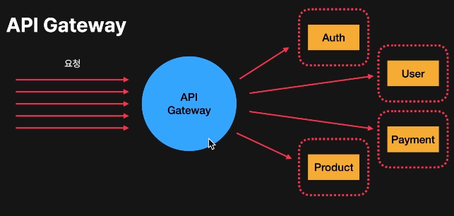
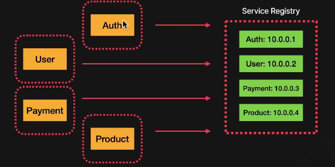
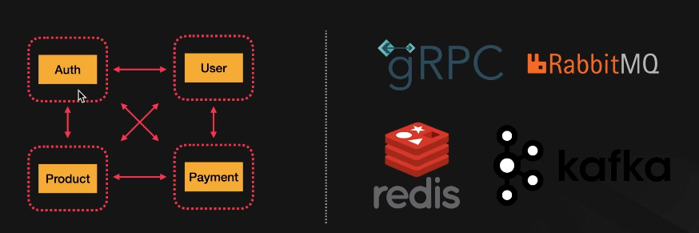
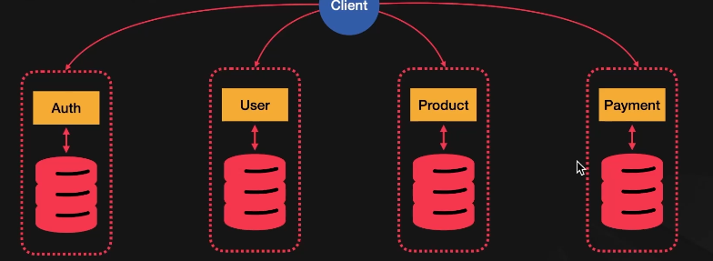
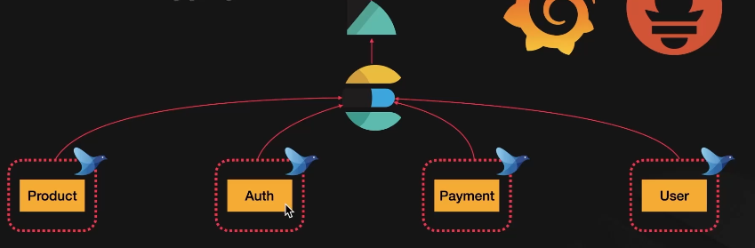
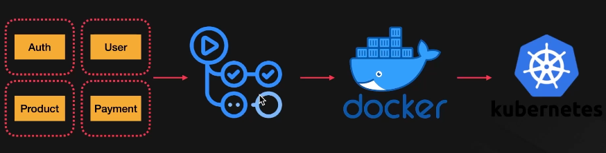
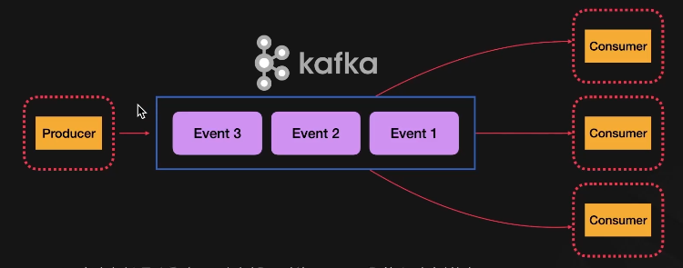

# MSA

## MSA의 주요 요소

- API Gateway
  - 모든 클라이언트 요청의 단독 엔트리 포인트 역할을 한다
  - 공통적인 제한/로직을 담당  
    ex) 인증, 쓰로틀링, 캐싱, 로깅 모니터링
  - 보안 레이어 역할을 한다.
- Service Discovery
  - 지속적으로 생성되고 삭제되는 서비스들을 쉽게 찾아낼 수 있도록 해준다.
  - Health Check를 통해 장애가 있는 서비스들을 제외시킨다.
- 서비스 간 통신: Inter-service Communication
  - 독립적으로 서비스를 개발 가능하다고 해서 서로 통신이 필요없는게 아니다.
  - Sync(동기): HTTP, gRPC
  - Async(비동기): RabbitMQ, Kafka, AWS SQS, Redis
- 독립 데이터베이스: 필수 사항 X
  - 각 서비스별로 최적화된 데이터베이스를 사용할 수 있다. (SQL, NoSQL 등)
- Distributed Logging & Monitoring
  - Microservice는 너무 많은 서비스들이 분산되어 운영되기 때문에, 로깅과 시스템 모니터링을 중앙화할 필요가 있다.
  - MSA가 복잡해질수록 서비스 간 요청의 흐름을 파악할 필요성이 높아진다.
- CI/CD Pipeline
  - 서비스가 많아질수록 배포과정과 스크립트가 복잡해진다.
  - 복잡하지만 시퀀스가 정확히 짜여져 있는 작업을 매번 수동으로 실행하는 건 비효율적이다. 그렇기 때문에 MSA를 배포할 때 CI/CD는 필수
- Event Driven Architecture
  - MSA는 서비스간 Async 통신을 할 수 있는 시스템을 디자인하는게 중요하다.
  - 모든 통신을 Sync로 진행하게 되면 안정성이 부족해지고 스케일링이 복잡해진다.

### API Gateway

- 강력한 보안 레이어가 될 수 있다.
- 통합된 인터페이스 제공이 가능하다.
- Signle Point of Failure 또는 Bottle Neck이 될 수 있다.
  - 최대한 가볍게 설계해서 리버스 프록시 역할에 충실하자

### Service Discovery

- Monolithic application은 모든 로직이 하나의 유닛으로 통합되어 있으니 서비스간 통신이 필요없다.
- MSA는 각 마이크로 서비스간 통신을 통해 다른 도메인에서 필요한 요소들을 불러올 수 있다.
- 대표적인 방법: Client/Server Side Service Discovery

### Inter-Microservice Communication

- MSA는 서비스간 통신이 매우 중요하다.
- 각 서비스간 안정적이고 효율적으로 통신을 할 수 있어야 하므로 다양한 솔루션이 존재한다.
- 직접적인 요청/응답 형태를 다루는 Sync 형태의 통신과 Queue 방식을 사용하는 Async 형태가 존재한다.

### 독립된 데이터베이스

- 각각 Microservice의 완전한 독립을 위해 데이터베이스를 도메인별로 따로 구축할 수 있다.
- 데이터베이스가 다운되었을 때 전체 시스템이 다운되지 않도록 해준다.
- 필수사항은 아니다. MSA의 목적에 따라 앱/웹 서버만 분리하고 데이터베이스는 하나 또는 공유할 수 있다.

### Distributed Logging

- Monolithic Architecture가 아니므로 단순히 파일에 로그를 생성하고 서버로 들어가서 볼 수 없다.
- 각 서비스에서 생성되는 로그들을 모두 통합해서 중앙화한 후 분석해야한다.
- 로그를 기반으로 각 시스템의 현재 상태를 모니터링할 수 있다.

### CI/CD Pipeline

- MSA로 수많은 서비스를 수동으로 배포하는 것은 말이 안된다.
- 개발 후 시스템적으로 문제를 파악하고 (CI/Test 등), 자동으로 빌드 및 패키징 후 오케스트레이션(K8s)에 배포될 수 있도록 시스템을 구성해야 효율적으로 MSA 운영이 가능하다.

### Event Driven Architecture

- Microservice가 많아질수록 효율적으로 안정성을 보장하고 Scaling을 할 수 있어야 한다.
- HTTP 등 동기 방식으로 통신하면 Scaling이 어려워진다.
- Async 방식으로 아키텍처를 설계하면 서비스간 효율적인 디커플링이 가능해지고 설계가 효율적이다.

